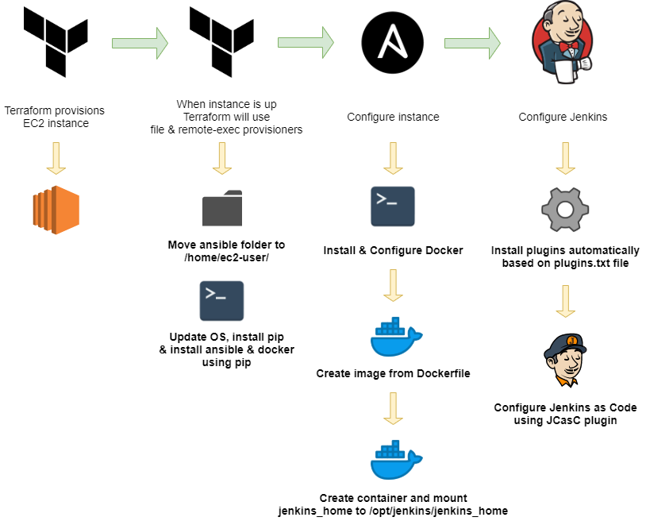

# Infrastructure & Configuration as code example

This repository demonstrates how to use Terraform, Ansible and JCasC plugin with Jenkins to configure everything as code.



## Install

You need to have Terraform installed to run this. Also you need to setup AWS Credentials for Terraform. I did create my ssh key with PuttyGen for this demonstration and added it under ssh/ folder. You have to provide the public key to main.tf file:

```
resource "aws_key_pair" "jenkins" {
  key_name   = "jenkins"
  public_key = "ssh-rsa <KEY_HERE>"
}
```

There is also another repository for jenkins_config [here](https://github.com/joonvena/jenkins_config) that uses Github Actions to update configuration file when someone pushes changes to master branch. You have to configure these environment variables for this repository:

- AWS_ACCESS_KEY
- AWS_SECRET_ACCESS_KEY
- BUCKET (Create S3 bucket and add your private key there. Action currently tries to download key named key.pem)
- JENKINS_URL (EC2 instance public_ip)
- TOKEN (Create his token <JENKINS_URL>/user/<USERNAME>/configure)
- USER (Your Jenkins username)
